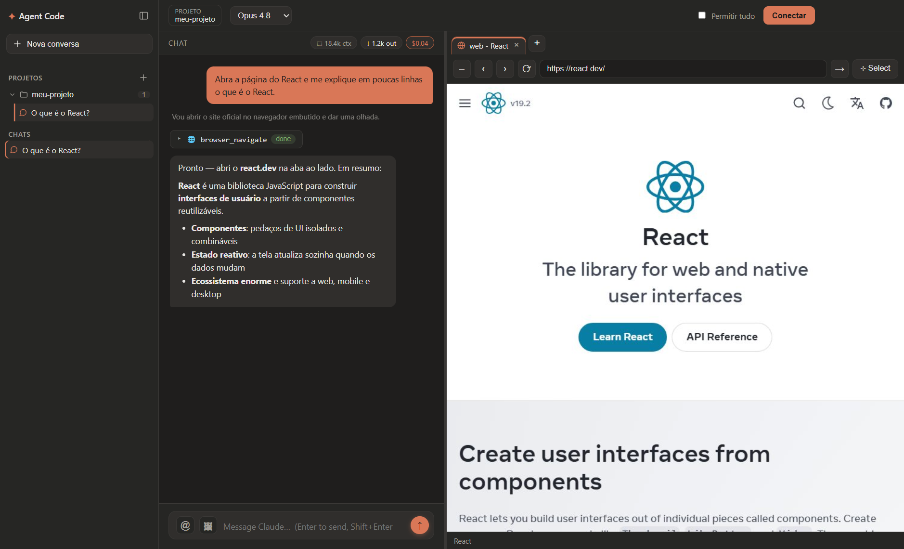

# Agent Code

> Interface desktop estilo **Claude Desktop** para o **Claude Code**, com um **navegador embutido que o próprio agente controla**.

Você conversa com o agente de um lado e ele pesquisa, abre sites e interage com páginas em um navegador renderizado **ao vivo dentro do app**, do outro lado — tudo em uma única janela.



## O que dá pra fazer

- 💬 **Conversar com o agente** (Claude) com streaming, markdown, cartões de ferramenta e medidor de tokens/custo.
- 🌐 **Navegador embutido controlado pelo agente** — agora um **Chrome de verdade** (perfil persistente por conversa, copiar/colar, captura nítida); ele navega, lê e clica em páginas e você vê tudo ao vivo.
- 🗂️ **Abas de preview** — várias páginas/dispositivos abertos ao mesmo tempo, e o agente sabe (e controla) qual aba está ativa.
- 📱 **Preview Android** — o agente sobe um emulador, gera o APK e testa o app ao vivo numa **moldura de celular**, podendo trocar entre modelos (S26 Ultra, Pixel, tablets…) ou resolução custom. _(iPhone planejado.)_
- 📡 **Controle remoto pelo celular** — um app Android moderno (pareado por QR, **token fixo**, **auto-reconexão**) mostra o histórico, envia comandos **e imagens**, renderiza **markdown** e mantém-se conectado. _(As permissões continuam aprovadas no PC.)_
- ⬇️ **Baixar arquivos pelo chat** — entregáveis criados pelo agente (APK, zip, PDF…) viram um botão **Baixar**, no PC e no celular.
- 📎 **Anexar imagens e qualquer arquivo** (Excel, PDF, zip, código…) por colar, arrastar ou pelo botão.
- 🖱️ **Selecionar um elemento da página** e enviá-lo pro chat com um clique.
- 🗄️ **Pasta de dados escolhida por você** — um SQLite (configs, API key, token Android) + memórias `.md` na pasta que você selecionar (por usuário, não por projeto).
- 🧩 **Kit de skills portátil** — skills versionadas no repo, ativadas automaticamente pelo `start.bat` ao clonar.
- 📁 **Histórico por projeto** · ⚡ **Várias conversas em paralelo** · 🔒 **Permissões por ferramenta** ("permitir tudo" liga/desliga na hora).

## Como rodar

**Windows (recomendado):** dê duplo-clique em `start.bat` — ele instala tudo e abre o app.

Ou manualmente:

```bash
npm install   # instala as dependências + baixa o Chromium
npm run dev   # abre o app
```

**Requisitos:** Node.js 20+ e o **Claude Code autenticado** na máquina (login do Claude Code ou `ANTHROPIC_API_KEY`).

## Stack

Electron + React + TypeScript, usando o **Claude Agent SDK** (o agente) e o **Playwright** (o navegador embutido).

## Documentação

- [docs/ARQUITETURA.md](docs/ARQUITETURA.md) — como o app funciona por dentro (processos, IPC, permissões, preview web/Android, build).
- [docs/REFERENCIA.md](docs/REFERENCIA.md) — referência arquivo por arquivo do projeto.
